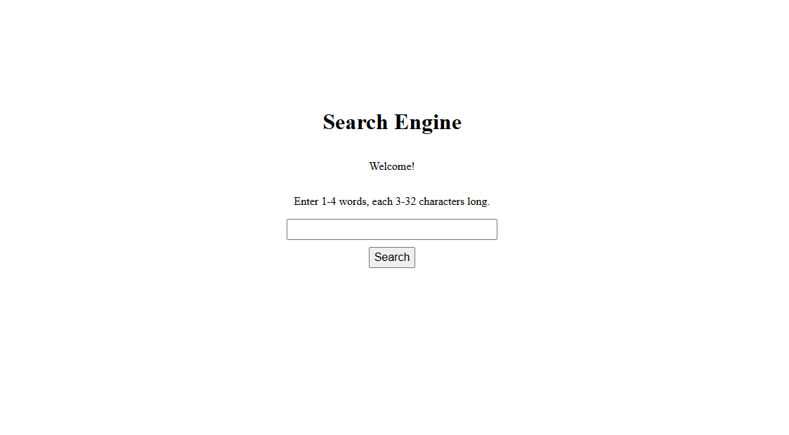

# Spider Search Engine


Проект представляет собой простую поисковую систему, разработанную как учебный проект на C++, для изучения веб-парсинга и поиска.\
Состоит из двух компонентов:
- **SpiderApp**: Веб-Паук, собирающий данные с веб-страниц, анализирующий их и сохраняющий в базу данных PostgreSQL.
- **HttpServerApp**: HTTP-сервер, предоставляющий веб-интерфейс для поиска по собранным данным.

> [!NOTE]
> Проект разработан и протестирован только для Windows. Совместимость с другими операционными системами не гарантируется.

## Возможности
- **SpiderApp**: Парсит до 10,000 уникальных URL с заданной глубиной, извлекает текст и частоту слов, сохраняет результаты в PostgreSQL.
- **HttpServerApp**: Обрабатывает поисковые запросы (1–4 слова, длиной 3–32 символа), возвращает до 10 релевантных результатов.

## Зависимости
- **C++17**: Компилятор с поддержкой стандарта (например, MSVC).
- **Boost**: Библиотека для работы с сетью (версия 1.87+).\
    Установка: Скачайте с [boost.org](https://www.boost.org/), затем соберите:
```
bootstrap.bat
b2 --with-asio --with-beast --with-system --with-date_time -j4 link=static threading=multi runtime-link=shared address-model=64 stage
```
- **PostgreSQL**: База данных (версия 13+).
- **libpqxx**: C++-библиотека для PostgreSQL (версия 7.10+).
- **MyHTML**: Библиотека парсинга HTML (только для SpiderApp).\
Установка: 
1. Скачайте с [GitHub](https://github.com/lexborisov/myhtml) (версия 4.0.5+).
2. Откройте `CMakeLists.txt` и найдите строку:
```
if(NOT MyHTML_BUILD_WITHOUT_THREADS)
```
Измените её на:
```
if(NOT MyHTML_BUILD_WITHOUT_THREADS AND NOT WIN32)
```
   Это отключает потоки на Windows для совместимости.

3. Сборка:
```
mkdir build
cd build
cmake ..
cmake --build . --config Release
cmake --install .
```
- **OpenSSL**: Для HTTPS-соединений в SpiderApp.

## Сборка проекта

1. Создайте директорию для сборки:
```
mkdir build
cd build
```
2. Сконфигурируйте проект:
```
cmake -DBOOST_ROOT="path/to/boost-1.87.0" ^
      -DLIBPQXX_DIR="path/to/libpqxx-7.10.0" ^
      -DMYHTML_INSTALL_DIR="path/to/myhtml-4.0.5/build/install" ^ ..
```
- Укажите свои пути к `BOOST_ROOT`, `LIBPQXX_DIR`, `MYHTML_INSTALL_DIR`. 
- **OpenSSL** должен быть добавлен в переменные среды PATH.
3. Соберите проект:
```
cmake --build . --config Release
```
В `build/Release` появятся `SpiderApp.exe` и `HttpServerApp.exe`.

## Настройка

- **Конфигурация базы данных**:\
Создайте базу данных PostgreSQL. Таблицы создаются автоматически при запуске SpiderApp.
- **Файл конфигурации**:\
Укажите свои данные для подключения к БД в config.ini. Укажите глубину и стартовый URL. Пример:
```
[database]
host=localhost
port=5432
dbname=your_db
user=your_user
password=your_password

[spider]
depth=2
start_url=https://en.wikipedia.org/wiki/Main_Page

[search]
port=8081
```

## Запуск

### SpiderApp
Ввести в консоль:
```
cd Realese
SpiderApp
```
Паук начнёт парсинг с start_url до глубины depth или лимита посещенных 10,000 URL.

### HttpServerApp:
После работы Паука ввести в консоль:
```
HttpServerApp
```
Скопируйте ссылку из консоли и откройте ее в браузере. Введите запрос.

> [!NOTE]
> - Убедитесь, что PostgreSQL запущен.
> - Логи Паука выводятся в консоль (время записи в БД и URL).
> - Сервер принимает только латинские буквы, цифры и пробелы в запросах.
> - Ограничение в 10000 URL установлено, чтобы не перегружать систему.

## Примеры работы
- Пример работы **SpiderApp**

- Пример работы **HttpServerApp**



## Лицензия
Проект распространяется под лицензией MIT (см. файл [LICENSE](LICENSE)).